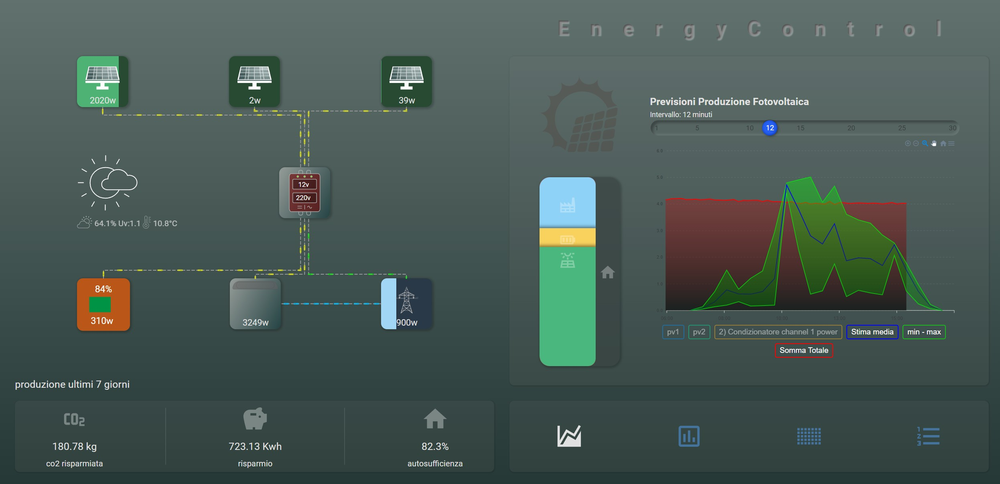

# photovoltaic-card
photovoltaic-card




  ```yaml
type: custom:photovoltaic-card
days: 15
entities:
  - pv: sensor.pv1
    max_power: 2500
    sensor_meter: sensor.consumo_giornaliero_pv1
    more_elements:
      - sensor.0xa4c138d9e90cb6c8_battery
  - pv: sensor.pv2
    max_power: 6000
    unit_of_mesurament: Kwh
    sensor_meter: sensor.consumo_giornaliero_pv2
  - pv: sensor.shellyem_05df18_channel_2_power
    max_power: 6000
    unit_of_mesurament: Kwh
    sensor_meter: sensor.consumo_giornaliero_shelly
grafic_forcast:
  forcast: sensor.solcast_pv_forecast_forecast_today
options:
  data_time_period: 12
tile_cards:
  - light.esp_bagni_luce_corridoio
  - light.luce_emma
  - light.esp_bagni_luce_corridoio
  - light.luce_emma
entity2: light.luce_emma
weather_entity: weather.forecast_casa
battery:
  battery_state: input_number.battery_power
  power: input_number.battery_power_2
  battery_meter: sensor.consumo_giornaliero_grid
  battery_to_inverter: input_number.energia_venduta
  more_elements:
    - sensor.0xa4c138d9e90cb6c8_battery
    - sensor.2_condizionatore_channel_1_energy
    - sensor.0xa4c1385d2f8c8977_battery
    - light.esp_bagni_luce_corridoio
    - light.esp_bagni_luce_corridoio
    - light.esp_bagni_luce_corridoio
grid:
  grid_entity: input_number.energia_aquista
  max_power: 6000
  grid_meter: sensor.consumo_giornaliero_grid
  sell_energy: input_number.energia_venduta
inverter:
  more_elements:
    - sensor.0xa4c138d9e90cb6c8_battery
    - sensor.2_condizionatore_channel_1_energy
    - sensor.0xa4c1385d2f8c8977_battery
    - light.esp_bagni_luce_corridoio
    - light.esp_bagni_luce_corridoio
    - light.esp_bagni_luce_corridoio
    - light.esp_bagni_luce_corridoio
    - light.esp_bagni_luce_corridoio
    - light.esp_bagni_luce_corridoio
    - light.esp_bagni_luce_corridoio
    - light.esp_bagni_luce_corridoio
    - light.esp_bagni_luce_corridoio
    - light.esp_bagni_luce_corridoio
    - light.esp_bagni_luce_corridoio
    - light.esp_bagni_luce_corridoio


```

 

P.s.: mi sono resto conto che in battery manca il sensore di voltaggio della corrente continua e alternata. 
nella tile di default saranno 12v 2 220v ma se sono disponibili e configurati nella tile verranno mostrati i calori correnti.
è una piccola implementazione che farò domani